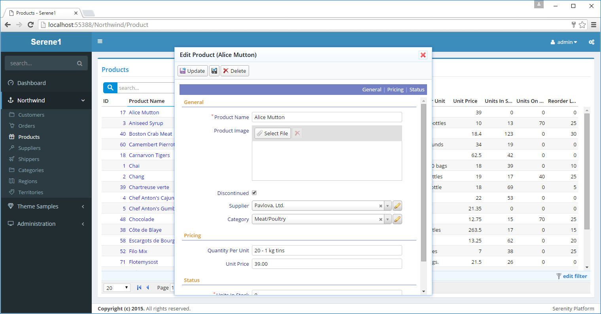

# Düzenleme Diyalogları

Ürün sayfasından bir ürün adına tıkladığınızda, o satır için düzenleme diyaloğu görüntülenir.



Bu diyalog istemci tarafında gösterilir, herhangi bir post-back işlemi sözkonusu değildir. Tıklanan kaydın verisi sunucu tarafından bir AJAX isteği ile getirilir (sadece veri, HTML gösterimi değil). 

> Diyalog nesnesi jQuery UI dialog objesinin Serene'ye özel temalandırılmış halidir.

Bu formda, alanlar üç kategoriye ayrılmıştır: *General (Genel)*, *Pricing (Fiyatlandırma)* ve *Status (Durum)*. Sağ üstteki kategori bağlantılarına tıklayarak, formdaki o kategorinin başlangıç noktasına hızlı bir şekilde ulaşabilirsiniz.

Her form alanı, bir etiket ve editör içeren bir satır işgal eder. 

> Bir satırda birden fazla alanı göstermeniz gerekirse CSS ile bunu sağlayabilirsiniz.

Etkileri "*" ile işaretlenmiş satırlar zorunlu alanlardır (boş olamaz).

Her alan, veri tipine göre belirlenmiş özel bir editör tipine sahiptir. Bunlar arasında *string (dize)*, *image upload (resim yükleme)*, *checkbox (işaret kutusu)*, *select (açılır liste)* sayılabilir.

Eğer formun HTML kodunu incelersek, şöyle bir yapı görürüz (açık olması için sadeleştirilmiştir):

```html

<div class="field ProductName">
    <label>Product Name</label>
    <input type="text" class="editor s-StringEditor" />
</div>

<div class="field ProductImage">
    <label class="caption"> Product Image</label>
    <div class="editor s-ImageUploadEditor">
        ...
    </div>
</div>

...
```

Her alan için, "field" CSS sınıfına sahip bir "div" bulunur. Bu "div" lerin içerisinde bir "label (etiket)" elemanı and o alanın editör tipine göre değişen bir başka eleman (input, select, div) bulunur.

Bu giriş elemanlarının CSS sınıflarına bakarak, editör tiplerini tespit edebiliriz (ör. *s-StringEditor*, *s-ImageUploadEditor*)


Araç çubuğunda, şu anki kaydı saklayıp diyaloğu kapatmak için bir *Update (Güncelle)* butonu bulunur. Hemen yanındaki *Apply Changes (Değişiklikleri Uygula)* butonu ise diğerinden farklı olarak kayıt sonrasında diyaloğu kapatmaz. Son olarak, en sağdaki *Delete (Sil)* düğmesi ile mevcut kayıt silinebilir.

Çoğu Serenity düzenleme diyaloğu bu alışılmış arayüze sahiptir. Ancak isterseniz, bu diyalogları özelleştirip, düğmeler, alanlar, sekmeler ya da benzeri farklı arayüz elemanları ekleyebilirsiniz.