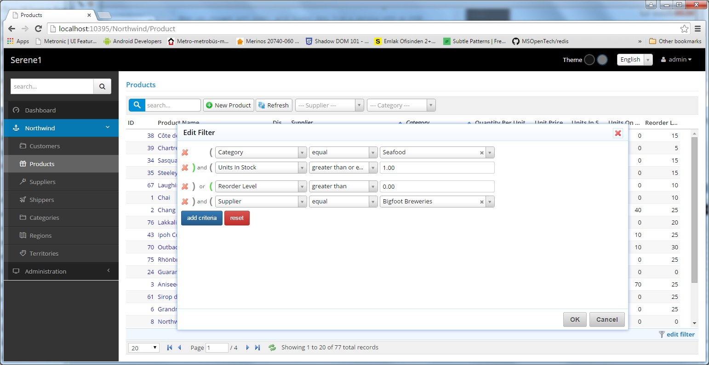

# Listeleme Sayfaları

Serene, Northwind veritabanı için listeleme ve düzenleme arayüzlerini içerir. Northwind modülü altındaki Products (Ürünler) sayfasına bir gözatalım.

Burada ürün ismine göre sıralanmış ürün listesini görüyoruz (başlangıç sıralaması).

> Kullanılan grid bileşeni, özel bir tema uygulanmış SlickGrid'dir:

> https://github.com/mleibman/SlickGrid

Kolon başlıklarına tıklayarak sıralamayı değiştirebilirsiniz. Ters sıralamak için kolon başlığına tekrar tıklayın.

Birden fazla kolona göre sıralamak için, Shift+Tıklama kullanabilirsiniz.

Önce *Category (Kategori)* sonra *Tedarikçi (Supplier)* kolonlarına göre sıralandığında grid şöyle bir şekil alır:

Sıralamayı değiştirdiğinizde, grid bir AJAX isteği ile servisten verileri tekrar yükledi.

> Sayfayı ilk açtığınızda gözüken başlangıç kayıtları da bir AJAX servis isteği ile yüklenmişti.

Varsayılan olarak, grid 100 lük sayfalar olarak kayıtları yükler. Sunucudan sadece etkin sayfadaki kayıtlar getirilir. Sol alttaki sayfa boyutunu 20 ye çekerek sayfalamanın nasıl çalıştığını görebilirsiniz.

Grid in sol üstündeki arama kutusuna bir kelime yazarak verileri basit bir şekilde süzebilirsiniz.

Örneğin *coffee* yazarak, bu kelimeyi ürün adında içeren ürünleri listeleyelim.

Bu arama varsayılan olarak ürün adında gerçekleşti. Başka bir alanda ya da birden fazla sahada da arama yaptırmak mümkün. Nasıl olacağına ilerleyen bölümlerde değineceğiz.

Grid in sağ üst bölümünde, *Supplier (Tedarikçi)* ve *Category (Kategori)* alanlarına göre hızlı filtreleme çekme (dropdown) menüleri mevcut.

> Kullanılan çekme (dropdown) bileşeni Select2'dir.

> https://github.com/select2/select2

Eğer kategori listesinden *Seafood* u seçersek, sadece o kategorideki ürünler listelenir.

> All sorting, paging and filtering is done on server side with dynamic SQL queries generated by Serenity service handlers.

It is also possible to filter by any column by clicking *edit filter* link at bottom right of the grid.

Here you can add criteria by any column by clicking *add criteria* and choosing column name, choosing comparison operator from next dropdown, and setting a value. 

Some value editors are simple textboxes while some others may have dropdowns and other custom editors depending on column type.

It is also possible to change *and* to *or* by clicking on it.

You can also group criteria by clicking parenthesis. Groups will have a bit more space between them than ordinary lines.

