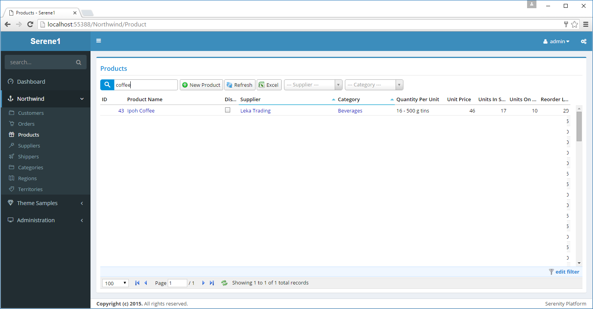
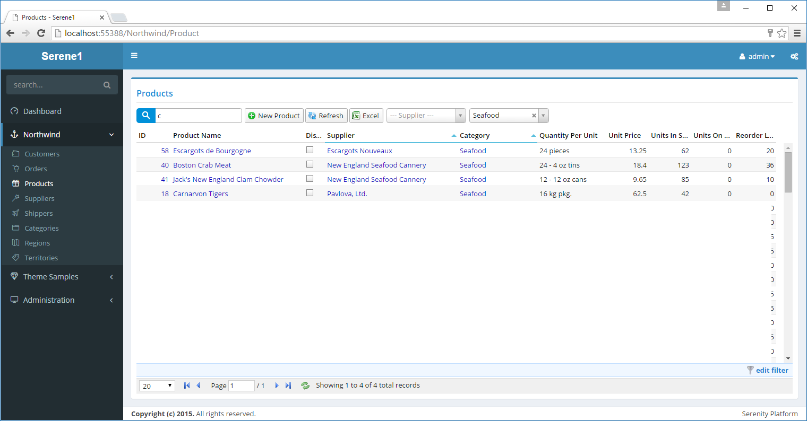

# Listeleme Sayfaları

Serene, Northwind veritabanı için listeleme ve düzenleme arayüzlerini içerir. Northwind modülü altındaki Products (Ürünler) sayfasına bir gözatalım.

Burada ürün ismine göre sıralanmış ürün listesini görüyoruz (başlangıç sıralaması).

> Kullanılan grid bileşeni, özel bir tema uygulanmış SlickGrid'dir:

> https://github.com/mleibman/SlickGrid

Kolon başlıklarına tıklayarak sıralamayı değiştirebilirsiniz. Ters sıralamak için kolon başlığına tekrar tıklayın.

Birden fazla kolona göre sıralamak için, Shift+Tıklama kullanabilirsiniz.

Önce *Category (Kategori)* sonra *Tedarikçi (Supplier)* kolonlarına göre sıralandığında grid şöyle bir şekil alır:

Sıralamayı değiştirdiğinizde, grid bir AJAX isteği ile servisten verileri tekrar yükledi.

> Sayfayı ilk açtığınızda gözüken başlangıç kayıtları da bir AJAX servis isteği ile yüklenmişti.

Varsayılan olarak, grid 100 lük sayfalar olarak kayıtları yükler. Sunucudan sadece etkin sayfadaki kayıtlar getirilir. Sol alttaki sayfa boyutunu 20 ye çekerek sayfalamanın nasıl çalıştığını görebilirsiniz.

Grid in sol üstündeki arama kutusuna bir kelime yazarak verileri basit bir şekilde süzebilirsiniz.

Örneğin *coffee* yazarak, bu kelimeyi ürün adında içeren ürünleri listeleyelim.

Bu arama varsayılan olarak ürün adında gerçekleşti. Başka bir alanda ya da birden fazla sahada da arama yaptırmak mümkün. Nasıl olacağına ilerleyen bölümlerde değineceğiz.

Grid in sağ üst bölümünde, *Supplier (Tedarikçi)* ve *Category (Kategori)* alanlarına göre hızlı filtreleme açılır listeleri (dropdown) mevcut.

> Kullanılan açılır liste (dropdown) bileşeni Select2'dir.

> https://github.com/select2/select2

Eğer kategori listesinden *Seafood* u seçersek, sadece o kategorideki ürünler listelenir.

> Tüm sıralama, sayfalama ve filtreleme işlemleri, sunucu tarafında, Serenity servis işleyicilerinin ürettiği dinamik SQL sorguları ile yapılmaktadır.

Sağ alttaki *edit filter (filtre düzenle)* bağlantısına tıklayarak, herhangi bir kolona göre filtrelemek te mümkün.

Bu ekranda, bir kolona göre filtre koşulu eklemek için, *add criteria (koşul ekle)* ye tıklayıp, istediğin kolon ismini seçebilirsiniz. Ardından karşılaştırma operatörünü seçip istediğiniz değeri girmelisiniz.

Buradaki bazı editörler basit metin kutuları iken, bazıları açılır listeler ya da kolon tipine göre değişen diğer özel editör tipleri olabilir.

Koşul satırları arasındaki bağlantıyı, *and (ve)* ile *or (veya)* arasında değiştirmek için üstlerine tıklayabilirsiniz.

Parantez işaretlerine tıklayarak, koşul satırlarını aralarında gruplamak (parantezlemek) te mümkündür. Gruplar arasında sıradan satırlardan biraz daha fazla boşluk bulunur.

