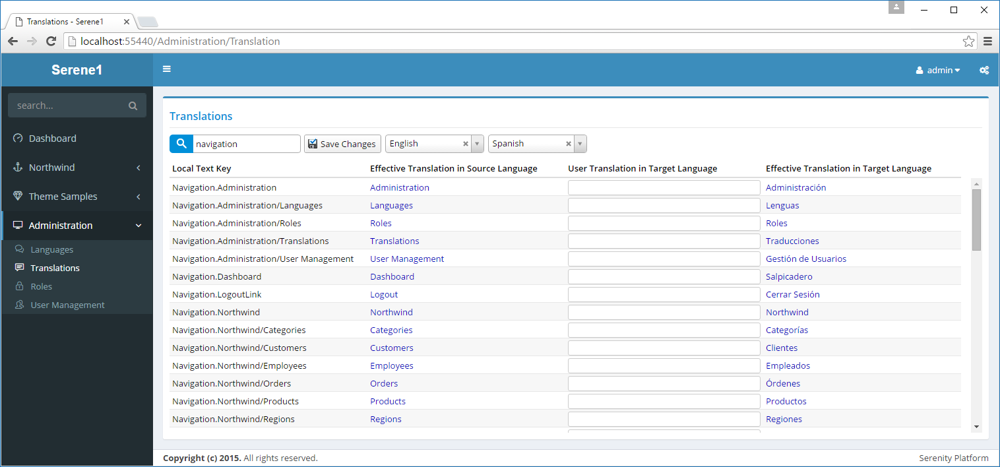
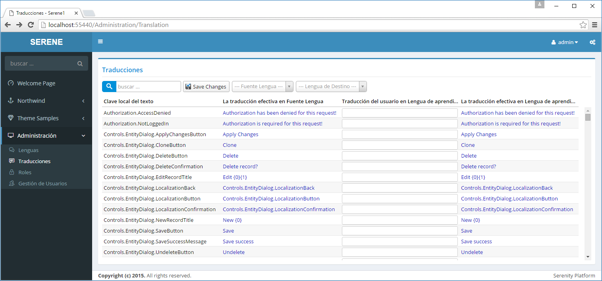

# Yerelleştirme

Serene, etkin arayüz dilini sağ üstteki ayarlar <i class="fa fa-gears"></i> menüsünden değiştirmenize izin verir.

Aktif dili ispanyolcaya (spanish) çevirmeyi deneyin.


> İspanyolcam olmadığından makina çevirisi kullandım, hatalar için kusura bakmayın...

Dili değiştirdiğinizde, temadaki durumdan farklı olarak, sayfa yeniden yüklendi.

Serene, bu sırada *"LanguagePreference"* adlı *"es"* içerikli bir çerezi tarayıcınıza ekledi. Bu sayede, siteyi tekrar ziyaret ettiğinizde, son dil tercihiniz saklanır ve sayfa ispanyolca olarak açılır.

Serene'yi ilk başlattığınızda, sayfayı muhtemelen ingilizce olarak gördünüz, fakat ispanyolca, türkçe ya da rusça da görmüş olabilirsiniz (bunlar şu an mevcut olan örnek diller), eğer işletim sisteminiz ya da tarayıcınız bu dillerden birine ayarlanmışsa.

Bu özellik bir web.config ayarıyla kontrol edilmektedir:

```xml
<globalization culture="en-US" uiCulture="auto:en-US" />
```

Burada arayüz kültürü (uiCulture - metinlerin gözüktüğü dil) otomatiğe ayarlanmış. Eğer sistem tarayıcı dilinizi tespit edemezse, son çare (fallback) olarak en-US tercih edilmesi ayarlanmış.

Başka bir dili, mesela türkçeyi fallback olarak kullanmanız da mümkün:

```xml
<globalization culture="en-US" uiCulture="auto:tr-TR" />
```

Ya da ziyaretçilerinizin tarayıcı dili ne olursa olsun, belli bir dille başlamasını sağlayabilirsiniz:

```xml
<globalization culture="en-US" uiCulture="es" />
```

> Eğer kullancılarınızın dil değiştirmesini istemiyorsanız, dil seçim menüsünü kaldırmalısınız.

> Dil seçim menüsüne daha *Administration / Languages (Sistem Yönetimi / Diller)* sayfasından başka diller de ekleyebilirsiniz.

## Arayüz Metinlerinin Yerelleştirilmesi

Serene, metin kaynaklarının kendi üzerinden canlı olarak yerelleştirilmesine imkan tanır.

Navigasyondan, önce *Administration (Sistem Yönetimi)*, sonra *Translations (Çeviriler)* bağlantısına tıklayınız. 



Sol üstteki arama kutusuna *navigation* yazarak, navigasyon menüsüyle ilgili metinlerin süzülmesini sağlayın. Kaynak dil (source language) olarak *English*, ve hedef dil (target language) olarak da *Spanish* seçin.

*Navigation.Dashboard* yerel metin anahtarının (local text key) gösterildiği satıra *Welcome Page* yazın.

*Save Changes (değişiklikleri kaydet)* e tıklayın.

İspanyolca diline geçiş yaptığınızda, daha önce *Salpicadero* olarak gösterilen gösterge menüsünün başlığının *Welcome Page* olarak değiştiğini göreceksiniz.



Değişiklikleri kaydettiğinizde, Serene `App_Data/texts` klasörü altında `user.texts.es.json` adlı, aşağıdaki içeriğe sahip bir dosya oluşturdu:

```json
{
    "Navigation.Dashboard": "Welcome Page"
}
```

Serene1.Web projesinin altındaki `~/scripts/site/texts` klasöründe, Serene arayüzü için varsayılan yerelleştirmeleri içeren benzer içerikli dosyalar bulunmaktadır:

- site.texts.es.json
- site.texts.invariant.json
- site.texts.tr.json

> Sitenizi yayına almadan önce, App_Data altındaki user.texts.xx.json dosyalarındaki metinleri site.texts.xx.json dosyalarına transfer etmeniz önerilir. Bu şekilde, eğer App_Data klasörünü ignore ettiyseniz, yerelleştirmelerinizi versiyon kontrol sisteminde tutabilirsiniz. Ayrıca canlıya sürüm atmanız da daha kolay olacaktır.