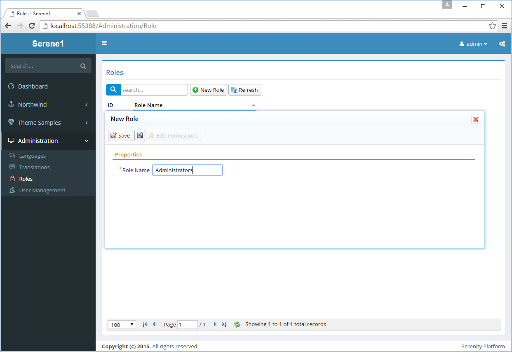
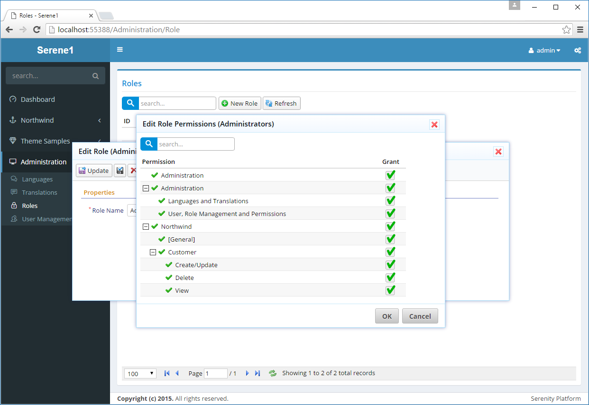
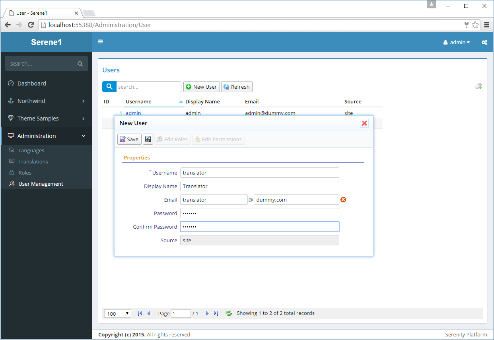
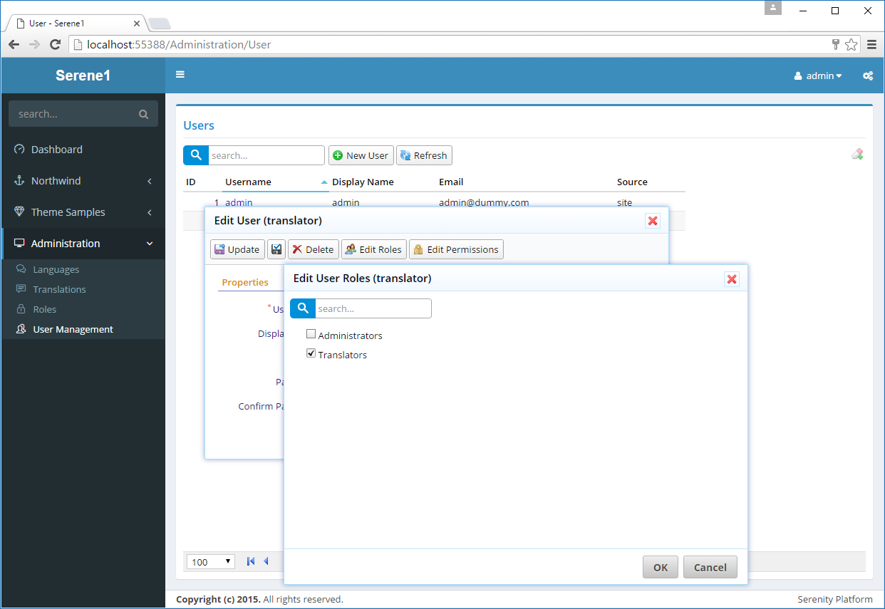
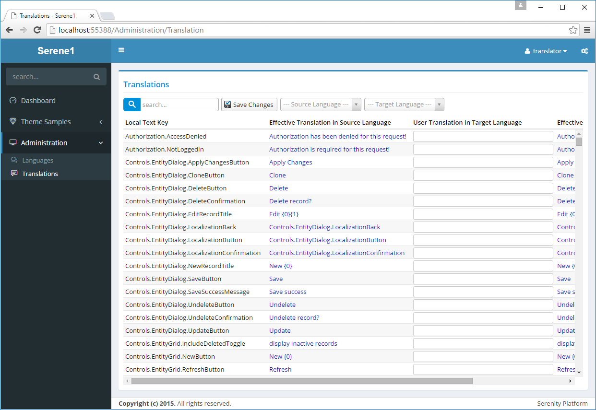

# Kullanıcı ve Rol Yönetimi

Serene kullanıcı, rol ve hak yönetimi sistemine sahiptir.

> Bu özellik Serenity'nin kendisinde entegre değildir. Her ne kadar tam özellikli çalışsa da bir örnek olarak hazırlanmıştır. İsterseniz kendinize has kullanıcı yönetiminizi tasarlayıp Serenity ile kullanabilirsiniz. Nasıl yapılacağını ilerleyen bölümlerde göreceğiz.

*Administration / Roles (Sistem Yönetimi / Roller)* sayfasını açıp *Administrators (Yöneticiler)* ve *Translators (Çevirmenler)* rollerini oluşturalım.

*New Role (Yeni Rol)* e tıklayıp *Administrators* yazın ve Save (Kaydet) düğmesine tıklayın.

Aynısını *Translators* için de tekrarlayın.

Sonra, *Administrators* rolüne tıklayıp düzenleme formunu açın ve *Edit Permissons (Hakları Düzenle)* düğmesine basarak yetki düzenleme ekranını açın. Tüm işaret kutularını doldurarak, role bütün yetkileri verin, ve ardından *OK (Tamam)* a tıklayın.

Aynı adımları *Translations* rolü için de tekrarlayın, fakat bu sefer sadece *Administration: Languages and Translations (Yönetim: Diller ve Çeviriler)* yetkisini verin.

Yeni kullanıcılar tanımlamak için *Administration / User Management (Sistem Yönetimi / Kullanıcı Yönetimi)* sayfasını açın.

Öncelik *admin* kullanıcısına tıklayarak detaylarını düzenleyin.

Burada, admin kullanıcısının kullanıcı adı, görünen ismi, e-posta gibi bilgilerini düzenleyebilirsiniz.

Ayrıca şifresini de değiştirebilirsiniz (varsayılan *serenity*). Bunun için *Password (Şifre)* and *Confirm Password (Şifre Onay)* sahalarına aynı şifreyi girdikten sonra *Update (Güncelle)* ye tıklamalısınız.

> Bu kullanıcıyı silmeniz de mümkün ancak bu durumda giriş yapamayacak duruma gelebilirsiniz.

*admin*, varsayılan olarak Serene için özel bir kullanıcıdır. Kendisine arayüzden bir yetki verilmemiş olsa da, tüm yetkilere sahip kabul edilir.

Başka bir kullanıcı oluşturup kendisine yetki verelim.

Bu diyaloğu kapatın, *New User (Yeni Kullanıcı)* ya tıklayın, ve kullanıcı adı olarak  *translator* girin. Diğer alanları istediğiniz gibi doldurduktan sonra *Save (Kaydet)* e basın.

> Belki farketmiş olabilirsiniz. *Save (Kaydet)* düğmesinin sağında siyah disk ikonuna sahip bir de *Apply Changes (Değişiklikleri Uygula)* düğmesi bulunur. *Save*'den farklı olarak, bu butonu kullandığınızda, form açık kalır ve kayıt sonrasında bilgilerin nasıl göründüğünü görebilirsiniz. Ayrıca formu kapatmadan yetkilerini de düzenleyebilirsiniz.

Şimdi *Translator* rolüne tıklayıp düzenleme formunu açın ve *Edit Roles (Rolleri Düzenle)* ye basın. Kullanıcıya *Translators* rolünü verin ve *OK (Tamam)* a basın.

> Bir kullanıcıya rol atadığınızda, o role verilmiş olan bütün yetkileri otomatik olarak alır. Kullanıcının yetkilerini düzenleyerek rolden farklı ek yetkiler verebilirsiniz. Ayrıca kullanıcıdan rol yetkilerini almak ta mümkündür.

Şimdi tüm dialogları kapatıp, sağ üstteki kullanıcı adına tıklayın ve *Logout (Çıkış Yap)* bağlantısına tıklayarak sistemden çıkın. Giriş sayfasına geri döneceksiniz.

Bu sefer *translator* kullanıcısı ve belirlemiş olduğunuz şifre ile giriş yapın.

Translator kullanıcısı sadece Dashboard, Theme Samples, Languages and Translations sayfalarını görebilecektir. Örneğin Northwind kendisine gözükmeyeecktir.

