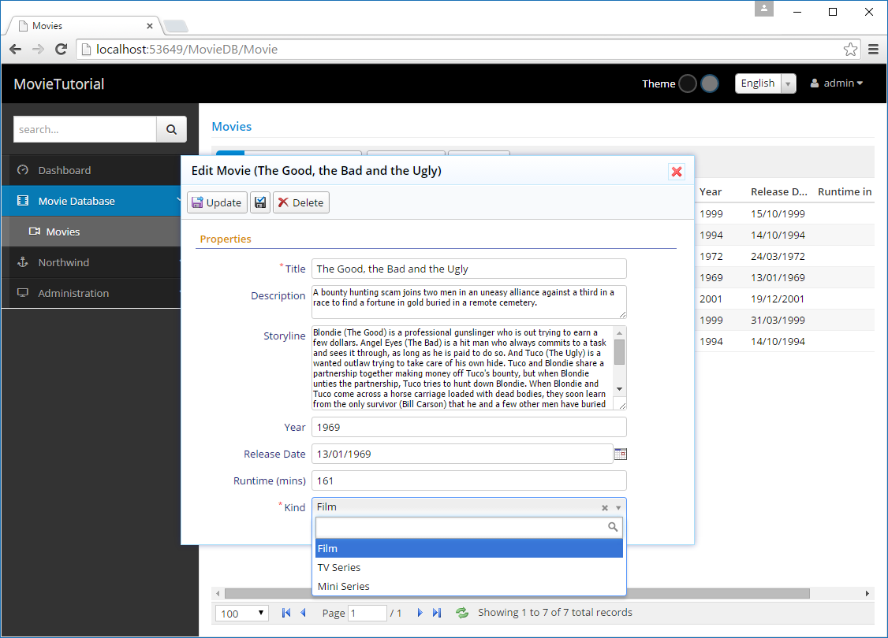

# Film Tipi Alanının Eklenmesi

Eğer sinema filmleri ile birlikte diziler ve mini dizileri de *Movie* tablomuzda tutmak isteseydik, bu bilgiyi saklamak için başka bir alana ihtiyacımız olurdu *Kind (Tip)*.

*Movie* tablosunu oluştururken bu alanı tanımlamadığımızdan, veritabanına eklemek için başka bir migration yazacağız.

 *MovieTutorial.Web/Modules/Common/Migrations/DefaultDB/ 
 DefaultDB_20150924_142200_MovieKind.cs*: dosyasında yeni bir migration oluşturun:

```cs
using FluentMigrator;
using System;

namespace MovieTutorial.Migrations.DefaultDB
{
    [Migration(20150924142200)]
    public class DefaultDB_20150924_142200_MovieKind : Migration
    {
        public override void Up()
        {
            Alter.Table("Movie").InSchema("mov")
                .AddColumn("Kind").AsInt32().NotNullable()
                    .WithDefaultValue(1);
        }

        public override void Down()
        {
        }
    }
}
```


### MovieKind Enumeration'ının Tanımlanması

*Kind* alanı *Movie* tablosuna ekledikten sonra, film tiplerini içeren bir listeye ihtiyacımız olacak. *MovieTutorial.Web/Modules/MovieDB/Movie/MovieKind.cs* altında bir enum olarak tanımlayalım:

```cs
using Serenity.ComponentModel;
using System.ComponentModel;

namespace MovieTutorial.MovieDB
{
    [EnumKey("MovieDB.MovieKind")]
    public enum MovieKind
    {
        [Description("Film")]
        Film = 1,
        [Description("TV Series")]
        TvSeries = 2,
        [Description("Mini Series")]
        MiniSeries = 3
    }
}
```


### Kind (Tip) Alanının MovieRow Varlığına Eklenmesi

As we are not using Sergen anymore, we need to add a mapping in our MovieRow.cs for *Kind* column manually. Add following property declaration in MovieRow.cs after *Runtime* property:

```cs
[DisplayName("Runtime (mins)")]
public Int32? Runtime
{
    get { return Fields.Runtime[this]; }
    set { Fields.Runtime[this] = value; }
}

[DisplayName("Kind"), NotNull]
public MovieKind? Kind
{
    get { return (MovieKind?)Fields.Kind[this]; }
    set { Fields.Kind[this] = (Int32?)value; }
}
```

We also need to declare a Int32Field object which is required for Serenity entity system. On the bottom of MovieRow.cs locate *RowFields* class and modify it to add *Kind* field after the *Runtime* field:

```cs
public class RowFields : RowFieldsBase
{
    // ...
    public readonly Int32Field Runtime;
    public readonly Int32Field Kind;

    public RowFields()
        : base("[mov].Movie")
    {
        LocalTextPrefix = "MovieDB.Movie";
    }
}
```


### Adding Kind Selection To Our Movie Form

If we build and run our project now, we'll see that there is no change in the Movie form, even if we added *Kind* field mapping to the *MovieRow*. This is because, fields shown/edited in the form are controlled by declerations in *MovieForm.cs*. 

Modify *MovieForm.cs* as below:

```cs

namespace MovieTutorial.MovieDB.Forms
{
    // ...
    [FormScript("MovieDB.Movie")]
    [BasedOnRow(typeof(Entities.MovieRow))]
    public class MovieForm
    {
        // ...
        public Int32 Runtime { get; set; }
        public MovieKind Kind { get; set; }
    }
}
```

Now, build your solution and run it. When you try to edit a movie or add a new one, nothing will happen. This is an expected situation. If you check developer tools console of your browser (F12, inspect element etc.) you'll see such an error:

```txt
Uncaught Can't find MovieTutorial.MovieDB.MovieKind enum type!
```

This error is caused by MoveKind enumeration not available client side. We should run our T4 templates before executing our program.

Now in Visual Studio, click *Build -> Transform All Templates* again.

Rebuild your solution and execute it. Now we have a nice dropdown in our form to select movie kind.




### Declaring a Default Value for Movie Kind

As *Kind* is a required field, we need to fill it in *Add Movie* dialog, otherwise we'll get a validation error.

But most movies we'll store are feature films, so its default should be this value.

To add a default value for *Kind* property, add a *DefaultValue* attribute like this:

```cs
[DisplayName("Kind"), NotNull, DefaultValue(1)]
public MovieKind? Kind
{
    get { return (MovieKind?)Fields.Kind[this]; }
    set { Fields.Kind[this] = (Int32?)value; }
}
```

Now, in *Add Movie* dialog, *Kind* field will come prefilled as *Film*.