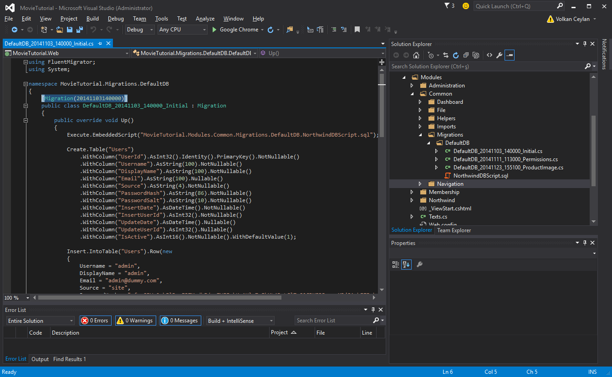

# *Movie (Film)* Tablosunun Oluşturulması

Filmlerin bir listesini saklamak için bir *Movie* tablosuna ihtiyacımız var. Bu tabloyu eski usül teknikleri kullanarak, SQL Management Studio ile manuel oluşturabilirdik. Fakat bizim tercihimiz, *Fluent Migrator* kitaplığından faydalanarak *migration (göç?)* sistemiyle oluşturmak:

> Fluent Migrator, .NET için geliştirilmiş, Ruby on Rails Migrations kitaplığına çok benzeyen bir migration framework'üdür. Migration'lar veritabanı şemasının değiştirilmesi için yapısal bir yoldur ve ilgili her yazılımcı tarafından ayrı ayrı çalıştırılması gereken birçok sql script'i hazırlama yöntemine bir alternatiftir. Migration'lar birden çok veritabanı ortamının evrim geçiren şemalarında karşılaşılan sorunları çözer (örneğin, geliştiricinin yerel veritabanı, test veritabanı ve canlı veritabanı). Veritabanı şema değişiklikleri, C# da yazılan sınıflar olarak tanımlanır ve bir sürüm kontrol sisteminde versiyonlanabilir (check in).

> FluentMigrator ile ilgili daha fazla bilgi için bkz. https://github.com/schambers/fluentmigrator.

*Solution Explorer* ile *MovieTutorial.Web / Modules / Common / Migrations / DefaultDB* klasörünü gidiniz.

> Aşağıdaki görüntü bu öğretici yazılırken alınmıştır. Serene'nin güncel sürümlerinde aynı lokasyonda DefaultDB ve NorthwindDB adında iki klasör bulunmaktadır. Çünkü Northwind veritabanı, Serene'nin kullanıcı, rol gibi bilgileri tuttuğu veritabanından ayrılmıştır ve iki ayrı veritabanı bulunmaktadır. Siz çalışmalarınızı DefaultDB altından yapabilirsiniz.



Görüntüde üç migration bulunmaktadır. Migration, veritabanı yapısını değiştiren bir DML (veri manupilasyon dili) script i gibidir.

*DefaultDB_20141103_140000_Initial.cs*, bizim *Users (Kullanıcı)* ve *Roles (Roller)* tablolarımızı oluşturan başlangıç migration ıdır.

Aynı klasörde (DefaultDB), adı *DefaultDB_20150915_185137_Movie.cs* olan yeni bir migration dosyası oluşturun. Bunun için mevcut dosyalardan birini kopyalayıp, adını değiştirip, içeriğini güncelleyebilirsiniz.

> Aslında migration dosya adı ve içindeki sınıfın adı sistem açısından önemsizdir, ancak tutarlılık ve düzgün sıralama için bu yapıda (y/a/g/sa/dk/sn) kullanmanız önerilir.

*20150915_185137* bu migration ı yazdığımız zamana *yyyyMMdd_HHmmss* formatında karşılık gelir. Ayrıca bu migration için benzersiz bir anahtar olarak da rol alacaktır.

Hazırlayacağımız migration dosyası şu şekilde bir içeriğe sahip olmalı:

```cs
using FluentMigrator;
using System;

namespace MovieTutorial.Migrations.DefaultDB
{
    [Migration(20150915185137)]
    public class DefaultDB_20150915_185137_Movie : Migration
    {
        public override void Up()
        {
            Create.Schema("mov");

            Create.Table("Movie").InSchema("mov")
                .WithColumn("MovieId").AsInt32().Identity().PrimaryKey().NotNullable()
                .WithColumn("Title").AsString(200).NotNullable()
                .WithColumn("Description").AsString(1000).Nullable()
                .WithColumn("Storyline").AsString(Int32.MaxValue).Nullable()
                .WithColumn("Year").AsInt32().Nullable()
                .WithColumn("ReleaseDate").AsDateTime().Nullable()
                .WithColumn("Runtime").AsInt32().Nullable();    
        }

        public override void Down()
        {
        }
    }
}
```

> Sınıfın isim alanının (namespace) *MovieTutorial.Migrations.DefaultDB* olduğundan emin olun, çünkü Serene sadece bu namespace deki migration ları *Default (varsayılan)* veritabanına uygular.

*Up()* metounda bu migration'ın uygulandığında, *mov* isimli bir şema oluşturacağını belirtiyoruz. Film tabloları için ayrı bir şema kullanacağız ki diğer tablolarla çakışmasın.
Migration ayrıca *Movie* isimli "MovieId, Title, Description... (Film ID, Başlık, Açıklama)" alanlarına sahip bir tablo da oluşturacak.

*Down()* metodunu doldurarak, bu migration ın gerektiğinde geri alınabilmesini de (film tablosunu silmek ve mov şemasını düşürmek gibi), fakat bu örnek kapsamında şimdilik boş bırakalım.

> Bir migration ın geri alınmaması pek sıkıntı yaratmayabilir ama yanlışlıkla bir tabloyu silmek çok daha büyük zararlara neden olabilir.

Sınıfımızın üstünde, bir *Migration* niteliği (attribute) uyguladık.

```cs
[Migration(20150915185137)]
```

Bu migration için benzersiz bir anahtar (unique key) belirler. Bir migration, veritabanına uygulandıktan sonra, anahtarı FluentMigrator'a özel bir tabloda ([dbo].[VersionInfo]) saklanır, bu sayede aynı migration tekrar uygulanmaz.

> Migration anahtarı sınıf ismiyle aynı olmalıdır, fakat isimden farklı olarak alt çizgi içeremez, çünkü migration anahtarları Int64 sayılardır.

> Migration lar anahtar sırasında (sayısal olarak küçükten büyüğe) uygulanır. Bu nedenle, yyyyMMdd gibi sıralanabilir bir tarih/zaman deseni tercih edilmesi idealdir (zorunlu olmasa da).


### Migration'ların Çalıştırılması

Varsayılan olarak, Serene şablonu *Default* veritabanı üzerinde *MovieTutorial.Migrations.DefaultDB* isim alanındaki tüm migration ları çalıştırır. Bu işlem ilk uygulama başlangıcında otomatik olarak yapılır. Migration ları çalıştıran kod *App_Start/SiteInitialization.cs*  dosyasındadır (güncel sürümlerde RunMigrations metodu *SiteInitialization.Migrations.cs* dosyasına taşınmıştır)

```cs

public static partial class SiteInitialization
{
    public static void ApplicationStart()
    {
        // ...
        EnsureDatabase();
    }

    private static void EnsureDatabase()
    {
        // ...
        RunMigrations();
    }

    private static void RunMigrations()
    {
        var defaultConnection = SqlConnections.GetConnectionString("Default");

        // safety check to ensure that we are not modifying another database
        if (defaultConnection.ConnectionString.IndexOf(
            typeof(SiteInitialization).Namespace + @"_Default_v1") < 0)
            return;

        using (var sw = new StringWriter())
        {
            //...
            var runner = new RunnerContext(announcer)
            {
                // ...
                Namespace = "MovieTutorial.Migrations.DefaultDB"
            };

            new TaskExecutor(runner).Execute();
        }
    }

```

> RunMigrations metodu içinde, migration ları yanlışlıkla Serene dışında, rastgele bir veritabanı üzerinde çalıştırmamak için, veritabanı adına göre kontrol yapan (MovieTutorial_Default_v1) bir güvenlik önlemi bulunmaktadır. Bu kontrolü (*safety check* yazan satırlar) risklerin farkında olduktan sonra kaldırabilirsiniz. 

> Bu kontrolün eklenmesinin sebebi, web.config deki bağlantı dizesini farkında olmadan değiştiriseniz, mesela canlı veritabanınıza, Northwind vs. tablolarını burada oluşturmayı engellemektir.

Şimdi F5 e basarak uygulamanızı çalıştırın ve Movie tablosunun veritabanında oluşturulmasını sağlayın.


### Migration'ın Çalışmış Olduğunu Doğrulama

Sql Server Management Studio ya da Visual Studio içinden *Connect To Database* aracıyla, *(localdb)\v11.0* sunucusundaki *MovieTutorial_Default_v1* veritabanına bağlanın.

> (localdb)\v11.0, SQL Server 2012 LocalDB tarafından oluşturulan bir LocalDB örneği (instance) dır. 

> Eğer henüz LocalDB'yi kurmadıysanız, şu adresten indirebilirsiniz https://www.microsoft.com/en-us/download/details.aspx?id=29062.

> Eğer SQL Server 2014 LocalDB ya da üstünü kullanıyorsanız, sunucu adınız (localdb)\v12.0, ya da (localdb)\MSSqlLocalDB olacaktır. web.config teki bağlantıları buna göre düzenleyin.

> Başka bir SQL server tipi de kullanabilirsiniz. Sadece bağlantı dizesini (connection string) web.config de değiştirin ve migration güvenlik kontrolünü kaldırın.

SQL öğe gezgininde (object explorer) *[mov].[Movies]* tablosunu görmelisiniz.

Ayrıca, *[dbo].[VersionInfo]* tablosunun içindeki verilere baktığınızda, tablonun son satırında, Version kolonundaki değer *20150915185137*. Bu, belirtilen versiyon numarasına sahip migration'ın veritabanı üzerinde çalıştırılmış olduğunu garantiler.
