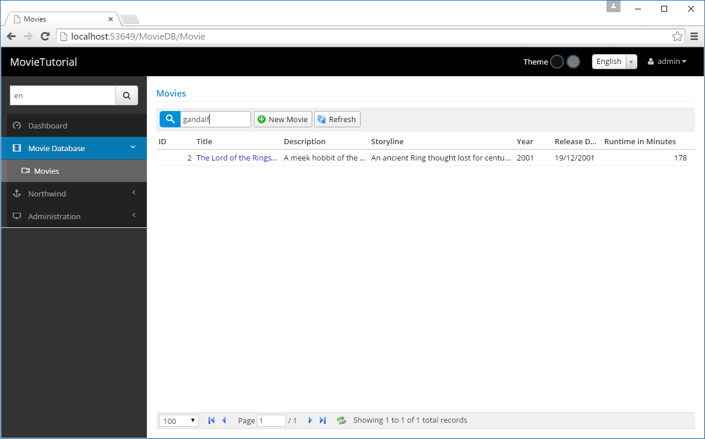

# Hızlı Aramanın Özelleştirilmesi

### Birkaç Film Kaydı Eklenmesi

Devam eden bölümler için bir miktar örnek veriye ihtiyacımız var. IMDB'den kopyala yapıştır yapabiliriz.

Eğer bununla vakit kaybetmek istemiyorsanız, aşağıdaki bağlantıda bir migration olarak mevcut:

> https://github.com/volkanceylan/Serenity-Tutorials/blob/master/MovieTutorial/MovieTutorial/MovieTutorial.Web/Modules/Common/Migrations/DefaultDB/DefaultDB_20150923_172700_SampleMovies.cs


Eğer arama kutucuğuna *go* yazarsak, iki filmin süzüldüğünü görürüz: *The Good, the Bad and the Ugly* ve *The Godfather*.

Eğer *Gandalf* yazsaydık, hiçbirşey bulamayacaktık. 

Sergen, varsayılan olarak tablonun ilk metinsel alanını *isim alanı (name field)* olarak seçer. Film tablomuzda bu alan *Title (Başlık)* tır. Bu alanın üstünde, metinsel aramaların bu alanda yapılacağını belirleyen bir *QuickSearch* niteliği (attribute) bulunmaktadır.

> İsim alanı ayrıca ilk sıralamaları belirler ve diyalog başlıklarında görüntülenir. 

Sometimes, first textual column might not be the name field. If you wanted to change it to another field, you would do it in *MovieRow.cs*:

```cs

namespace MovieTutorial.MovieDB.Entities
{
    //...
    public sealed class MovieRow : Row, IIdRow, INameRow
    {
        //...
        StringField INameRow.NameField
        {
            get { return Fields.Title; }
        }
}
```

Code generator determined that first textual (string) field in our table is Title. So it added a INameRow interface to our Movies row and implemented it by returning Title field. If wanted to use Description as name field, we would just replace it.

Here, *Title* is actually the name field, so we leave it as is. But we want Serenity to search also in *Description* and *Storyline* fields. To do this, you need to add *QuickSearch* attribute to these fields too, as shown below:

```
namespace MovieTutorial.MovieDB.Entities
{
    //...
    public sealed class MovieRow : Row, IIdRow, INameRow
    {
        //...
        [DisplayName("Title"), Size(200), NotNull, QuickSearch]
        public String Title
        {
            get { return Fields.Title[this]; }
            set { Fields.Title[this] = value; }
        }

        [DisplayName("Description"), Size(1000), QuickSearch]
        public String Description
        {
            get { return Fields.Description[this]; }
            set { Fields.Description[this] = value; }
        }

        [DisplayName("Storyline"), QuickSearch]
        public String Storyline
        {
            get { return Fields.Storyline[this]; }
            set { Fields.Storyline[this] = value; }
        }
        //...
    }
}
```

Now, if we search for *Gandalf*, we'll get a *The Lord of the Rings* entry:



QuickSearch attribute, by default, searches with *contains* filter. It has some options to make it match by *starts with* filter or match only exact values.

If we wanted it to show only rows that *starts with* typed text, we would change attribute to:

```cs
[DisplayName("Title"), Size(200), NotNull, QuickSearch(SearchType.StartsWith)]
public String Title
{
    get { return Fields.Title[this]; }
    set { Fields.Title[this] = value; }
}
```

> Here this quick search feature is not very useful, but for values like SSN, serial number, identification number, phone number etc, it might be.

If we wanted to search also in year column, but only exact integer values (1999 matches but not 19):

```
[DisplayName("Year"), QuickSearch(SearchType.Equals, numericOnly: 1)]
public Int32? Year
{
    get { return Fields.Year[this]; }
    set { Fields.Year[this] = value; }
}
```

> You might have noticed that we are not writing any C# or SQL code for these basic features to work. We just specify what we want, rather than how to do it. This is what declarative programming is. 

It is also possible to provide user with ability to determine which field she wants to search on.

Open *MovieTutorial.Script/MovieDB/Movie/MovieGrid.cs* and modify it like:

```

namespace MovieTutorial.MovieDB
{
    //...
    public class MovieGrid : EntityGrid<MovieRow>
    {
        public MovieGrid(jQueryObject container)
            : base(container)
        {
        }

        protected override List<QuickSearchField> GetQuickSearchFields()
        {
            return new List<QuickSearchField>
            {
                new QuickSearchField { Name = "", Title = "all" },
                new QuickSearchField { Name = "Description", Title = "description" },
                new QuickSearchField { Name = "Storyline", Title = "storyline" },
                new QuickSearchField { Name = "Year", Title = "year" }
            };
        }
    }
    ///...
}
```

Now we have a dropdown in quick search input:


> Unlike prior samples where we modified Server side code, this time we did changes in Script side, and actually modified javascript code.


### Running T4 Templates (.tt files)

In prior sample we harcoded field names like *Description*, *Storyline* etc. This may lead to typing errors if we forgot actual property names at server side.

Serene contains some T4 (.tt) files to transfer such information from server side (rows etc) to client side for intellisense purposes.

Before running these templates, please make sure that your solution builds successfully as templates uses your output DLL files (*MovieTutorial.Web.dll*, *MovieTutorial.Script.dll*) to generate code.

After building your solution, click on *Build* menu, than *Transform All Templates*.

> If you are using a Serene version before 1.6.0, you might get an error like following:

> ```
> Error CS0579 Duplicate 'Imported' attribute ...
> ```
> 
> To resolve it, just remove following lines from file *MovieGrid.cs* under *MovieTutorial.Script/MovieDB/Movie*:

> ```cs
> // Please remove this partial class or the first line below, 
> // after you run ScriptContexts.tt
> [Imported, Serializable, PreserveMemberCase] 
> public partial class MovieRow
> {
> }
> ```


We can use intellisense to replace hardcoded field names with compile time checked versions:

```cs
namespace MovieTutorial.MovieDB
{
    // ...
    public class MovieGrid : EntityGrid<MovieRow>
    {
        public MovieGrid(jQueryObject container)
            : base(container)
        {
        }

        protected override List<QuickSearchField> GetQuickSearchFields()
        {
            return new List<QuickSearchField>
            {
                new QuickSearchField { Name = "", Title = "all" },
                new QuickSearchField { Name = MovieRow.Fields.Description, 
                    Title = "description" },
                new QuickSearchField { Name = MovieRow.Fields.Storyline, 
                    Title = "storyline" },
                new QuickSearchField { Name = MovieRow.Fields.Year, 
                    Title = "year" }
            };
        }
    }
}
```

