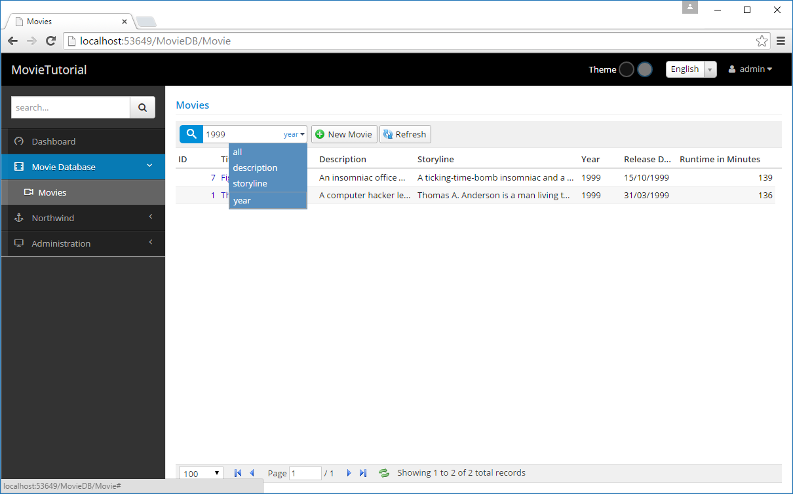

# Hızlı Aramanın Özelleştirilmesi

### Birkaç Film Kaydı Eklenmesi

Devam eden bölümler için bir miktar örnek veriye ihtiyacımız var. IMDB'den kopyala yapıştır yapabiliriz.

Eğer bununla vakit kaybetmek istemiyorsanız, aşağıdaki bağlantıda bir migration olarak mevcut:

> https://github.com/volkanceylan/Serenity-Tutorials/blob/master/MovieTutorial/MovieTutorial/MovieTutorial.Web/Modules/Common/Migrations/DefaultDB/DefaultDB_20150923_172700_SampleMovies.cs


Eğer arama kutucuğuna *go* yazarsak, iki filmin süzüldüğünü görürüz: *The Good, the Bad and the Ugly* ve *The Godfather*.

Eğer *Gandalf* yazsaydık, hiçbirşey bulamayacaktık. 

Sergen, varsayılan olarak tablonun ilk metinsel alanını *isim alanı (name field)* olarak seçer. Film tablomuzda bu alan *Title (Başlık)* tır. Bu alanın üstünde, metinsel aramaların bu alanda yapılacağını belirleyen bir *QuickSearch* niteliği (attribute) bulunmaktadır.

> İsim alanı ayrıca ilk sıralamaları belirler ve diyalog başlıklarında görüntülenir. 

Bazen tablonun ilk alanı isim alanı olmayabilir. Eğer başka bir alana değiştirmek isterseniz, bunu *MovieRow.cs* içerisinde yapabilirsiniz:

```cs

namespace MovieTutorial.MovieDB.Entities
{
    //...
    public sealed class MovieRow : Row, IIdRow, INameRow
    {
        //...
        StringField INameRow.NameField
        {
            get { return Fields.Title; }
        }
}
```

Kod üretici tablomuzdaki ilk metinsel (string) alanın *Title* olduğunu tespit etti. Bu nedenle, *MovieRow* umuza, *INameRow* arayüzünü ekledi ve bu arayüzü *Title* alanını döndürerek sağladı. Eğer *Description (Açıklama)* alanını isim olarak kullanmak isteseydi, *Title* yerine *Description* yazabilirdik.

Bu tabloda, *Title* zaten isim alanıdır, bu nedenle şimdilik olduğu gibi bırakıyoruz. Fakat, Serenity'nin *Description* ve *Storyline* alanlarında da hızlı arama yapmasını istiyoruz. Bunun için de, bu alanlara da *QuickSearch (Hızlı Arama)* niteliğini eklememiz gerekiyor:

```
namespace MovieTutorial.MovieDB.Entities
{
    //...
    public sealed class MovieRow : Row, IIdRow, INameRow
    {
        //...
        [DisplayName("Title"), Size(200), NotNull, QuickSearch]
        public String Title
        {
            get { return Fields.Title[this]; }
            set { Fields.Title[this] = value; }
        }

        [DisplayName("Description"), Size(1000), QuickSearch]
        public String Description
        {
            get { return Fields.Description[this]; }
            set { Fields.Description[this] = value; }
        }

        [DisplayName("Storyline"), QuickSearch]
        public String Storyline
        {
            get { return Fields.Storyline[this]; }
            set { Fields.Storyline[this] = value; }
        }
        //...
    }
}
```

Eğer şimdi *Gandalf* kelimesini ararsak, *The Lord of the Rings (Yüzüklerin Efendisi)* kaydını da bulacağız:


QuickSearch niteliği varsayılan olarak *contains (içerir)* filtresiyle arar. Ayrıca *starts with (ile başlar)* ya da tam metinle aramak için de bazı seçenekleri bulunmaktadır.

Eğer sadece aranan kelime *ile başlayan* kayıtları göstermesini isteseydik, şu şekilde yapabilirdik:

```cs
[DisplayName("Title"), Size(200), NotNull, QuickSearch(SearchType.StartsWith)]
public String Title
{
    get { return Fields.Title[this]; }
    set { Fields.Title[this] = value; }
}
```

> Bu hızlı arama örnekte çok kullanışlı değil ama kimlik numarası, seri numarası, telefon numarsaı gibi farklı veri türleri için faydalı olabilir.

Eğer, ayrıca yıl kolonunda da arama yapılmasını, ancak tam eşleşen sayısal değerlerin bulunmasını isteseydik (1999 olarak aranırsa eşlecek ama sadece 19 yazılırsa sonuç bulmayacak):

```
[DisplayName("Year"), QuickSearch(SearchType.Equals, numericOnly: 1)]
public Int32? Year
{
    get { return Fields.Year[this]; }
    set { Fields.Year[this] = value; }
}
```

> Bu temel özelliklerin çalışması için herhangi bir C# ya da SQL kodu yazmadığımızı farketmiş olmalısınız. Sadece ne istediğimizi belirtiyoruz, nasıl yapılacağını değil. Bu *deklaratif programlama* desenidir.

Şu an *QuickSearch* niteliği olan bütün alanlarda aynı anda arama yapılıyor. Kullanıcının, bu alanlardan hangisinde arama yapmak istediğine kendisinin karar verebilmesi de mümkün:

*MovieTutorial.Script/MovieDB/Movie/MovieGrid.cs* dosyasını açıp şunun gibi düzenleyin:

```

namespace MovieTutorial.MovieDB
{
    //...
    public class MovieGrid : EntityGrid<MovieRow>
    {
        public MovieGrid(jQueryObject container)
            : base(container)
        {
        }

        protected override List<QuickSearchField> GetQuickSearchFields()
        {
            return new List<QuickSearchField>
            {
                new QuickSearchField { Name = "", Title = "all" },
                new QuickSearchField { Name = "Description", Title = "description" },
                new QuickSearchField { Name = "Storyline", Title = "storyline" },
                new QuickSearchField { Name = "Year", Title = "year" }
            };
        }
    }
    ///...
}
```

Şimdi hızlı arama kutucuğunda ek olarak bir çekme menümüz mevcut:



> Sunucu tarafı kodlarını düzenlediğimiz daha önceki örneklerimizden farklı olarak, bu sefer Script projesinde değişiklikler yaptık ve aslında javascript kodlarını düzenlemiş olduk.


### T4 Şablonlarının Çalıştırılması (.tt uzantılı dosyalar)

Örneğimizde, alan isimlerini *"Description"*, *"Storyline"* gibi string olarak kodladık. Bu tip durumlar eğer alan isimlerini yanlış hatırlarsak, hata yapmaya meğillidir.

Serene, bu tür bilgileri sunucu tarafından (row lar vs.) istemci tarafına, intellisense amacıyla taşıyabilmek için bazı T4 (.tt) şablon dosyaları içerir.

Bu şablonları çalıştırmadan önce, solution ın başarılı bir şekilde derlendiğinden emin olunuz. Çünkü şablonlar kod üretmek için derleme çıktıları olan DLL dosyalarınızı (*MovieTutorial.Web.dll*, *MovieTutorial.Script.dll*) kullanmaktadır.

Solution'ı derledikten sonra *Build (Derleme)* menüsüne tıklayın ve ardından *Transform All Templates (Tüm Şablonları Dönüştür)*'e tıklayın.

> Eğer Serene'nin 1.6.0 öncesi bir sürümündeyseniz, aşağıdakine benzer bir hata alabilirsiniz:

> ```
> Error CS0579 Duplicate 'Imported' attribute ...
> ```
> 
> Çözmek için, *MovieTutorial.Script/MovieDB/Movie* altındaki *MovieGrid.cs* dosyasından şu satırları kaldırmanız yeterlidir:

> ```cs
> // Please remove this partial class or the first line below, 
> // after you run ScriptContexts.tt
> [Imported, Serializable, PreserveMemberCase] 
> public partial class MovieRow
> {
> }
> ```

Artık, string olarak yazılan alan isimleri yerine derleme zamanı kontrollü intellisense versiyonlarını yerleştirebiliriz:

```cs
namespace MovieTutorial.MovieDB
{
    // ...
    public class MovieGrid : EntityGrid<MovieRow>
    {
        public MovieGrid(jQueryObject container)
            : base(container)
        {
        }

        protected override List<QuickSearchField> GetQuickSearchFields()
        {
            return new List<QuickSearchField>
            {
                new QuickSearchField { Name = "", Title = "all" },
                new QuickSearchField { Name = MovieRow.Fields.Description, 
                    Title = "description" },
                new QuickSearchField { Name = MovieRow.Fields.Storyline, 
                    Title = "storyline" },
                new QuickSearchField { Name = MovieRow.Fields.Year, 
                    Title = "year" }
            };
        }
    }
}
```

> Aslında 1.7.0 dan sonra bunu yapmamıza gerek yoktu, çünkü Sergen MovieRow'un script sürümünü de başlangıçta üretir. Ancak, sonradan yeni alanlar eklediğinizde, bu alanların script tarafına taşınması için yine de bu şablonları dönüştüreceksiniz.

